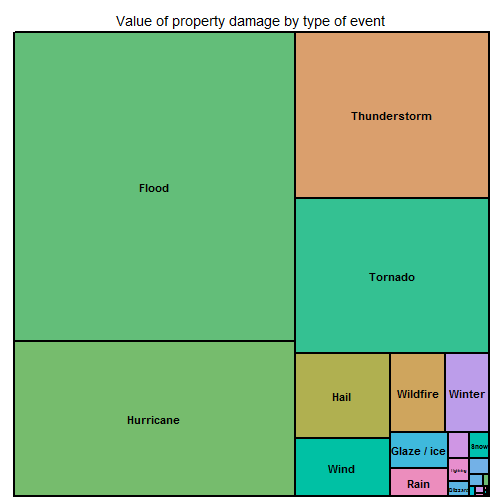

<h1>Health and economic consequences of storm events</h1>

There are couple of problems with storm data set. We have tried to deal with them, or at least describe them and propose some solutions. In general there are couple of storm events that are very harmful for people (tornado, lightning, wind, heat, flood). Some of them also very costly in sense of in sense of caused damages. These include flood, tornado, thunderstorm. However there are also such events as rain, which is related with relatively small amount of injuries and fatalties, but damages caused by it costs quite much.

<h3>Data Processing</h3>
To load our data set to R we have downloaded it, then unzip using <em>bunzip2</em> function from <em>R.utils</em> package and finally load with <em>read.csv</em> function.


<pre><code class="r">download.file(url = "https://d396qusza40orc.cloudfront.net/repdata%2Fdata%2FStormData.csv.bz2",
              destfile='StormData.bz2')
library(R.utils)
bunzip2(filename="StormData.bz2", destname='StormData.csv', remove=FALSE)
data <- read.csv('StormData.csv')
</code></pre>

Now we can start play with data. First of all our data set is not tidy.
There are couple of problems that we should face to answer only two questions.

<h5>Type of event</h5>
Let's have a look at <strong>EVTYPE</strong> variable. It has 985 unique values. If we want all unique names of events that are related with <strong>thunderstorm</strong> it will come out that there are 91 such values.


```r
unique(grep('thun', tolower(data$EVTYPE), value=TRUE))
```

```
##  [1] "thunderstorm winds"             "thunderstorm wind"             
##  [3] "thunderstorm wins"              "thunderstorm winds lightning"  
##  [5] "thunderstorm winds/hail"        "thunderstorm winds hail"       
##  [7] "flash flooding/thunderstorm wi" "thunderstorm"                  
##  [9] "thunderstorm winds/funnel clou" "severe thunderstorm"           
## [11] "severe thunderstorms"           "severe thunderstorm winds"     
## [13] "thunderstorms winds"            "thunderstorms"                 
## [15] "lightning thunderstorm windss"  "thunderstorm winds 60"         
## [17] "thunderstorm windss"            "lightning thunderstorm winds"  
## [19] "lightning and thunderstorm win" "thunderstorm winds53"          
## [21] "thunderstorm winds 13"          "thundersnow"                   
## [23] "thunderstorm winds urban flood" "thunderstorm winds small strea"
## [25] "thunderstorm winds 2"           "thunderstorm winds 61"         
## [27] "thunderstorm damage"            "thundertorm winds"             
## [29] "thunderstormw 50"               "thunderstorms wind"            
## [31] "thunderstorm  winds"            "thundertsorm wind"             
## [33] "thunderstorm winds/ hail"       "thunderstorm wind/lightning"   
## [35] "thundestorm winds"              "thunderstorm wind g50"         
## [37] "thunderstorm winds/heavy rain"  "thunderstrom winds"            
## [39] "thunderstorm winds      le cen" "thunderstorm winds g"          
## [41] "thunderstorm wind g60"          "thunderstorm winds."           
## [43] "thunderstorm wind g55"          "thunderstorm winds g60"        
## [45] "thunderstorm winds funnel clou" "thunderstorm winds 62"         
## [47] "thunderstorm winds/flash flood" "thunderstorm winds 53"         
## [49] "thunderstorm wind 59"           "thunderstorm wind 52"          
## [51] "thunderstorm wind 69"           "thunderstormw winds"           
## [53] "thunderstorm wind 60 mph"       "thunderstorm wind 65mph"       
## [55] "thunderstorm wind/ trees"       "thunderstorm wind/awning"      
## [57] "thunderstorm wind 98 mph"       "thunderstorm wind trees"       
## [59] "thunderstorm wind 59 mph"       "thunderstorm winds 63 mph"     
## [61] "thunderstorm wind/ tree"        "thunderstorm damage to"        
## [63] "thunderstorm wind 65 mph"       "thunderstorm wind."            
## [65] "thunderstorm wind 59 mph."      "thunderstorm hail"             
## [67] "thunderstorm windshail"         "thunderstorm winds and"        
## [69] "thunderstorm winds 50"          "thunderstorm wind g52"         
## [71] "thunderstorm winds 52"          "thunderstorm wind g51"         
## [73] "thunderstorm wind g61"          "thunderestorm winds"           
## [75] "thunderstorm winds/flooding"    "thundeerstorm winds"           
## [77] "thunderstorm w inds"            "thunderstorm wind 50"          
## [79] "thunerstorm winds"              "thunderstorm wind 56"          
## [81] "thunderstorm wind/hail"         "thunderstormw"                 
## [83] "thunderstorm winds/ flood"      "thunderstormwinds"             
## [85] "thunderstorm winds heavy rain"  "thunderstrom wind"             
## [87] "thundersnow shower"             "thunderstorm wind (g40)"       
## [89] "gusty thunderstorm winds"       "gusty thunderstorm wind"       
## [91] "marine thunderstorm wind"
```

As we can see there are different types of thunderstorm, but there are also couple of misspells like:
<em>thundeerstorm, thunderstormw, thundertsorm, thundestorm, thunderestorm, thunerstorm</em>.

Therefore we decided to group them all together. Below there are listed all modifications of our data set. We have created new variable named <strong>EventType</strong>. Then we was looking for a given pattern. For example all event types that contain words <em>wild</em> or <em>fire</em> we have marked as <em>wildfire</em>.


```r
data$EventType <- as.character(data$EVTYPE)
data$EventType[grep('erosion', tolower(data$EVTYPE))] <- 'Erosion'
data$EventType[grep('blizzard', tolower(data$EVTYPE))] <- 'Blizzard'
data$EventType[grep('blowing', tolower(data$EVTYPE))] <- 'Blowing'
data$EventType[grep('flood', tolower(data$EVTYPE))] <- 'Flood'
data$EventType[grep('cold', tolower(data$EVTYPE))] <- 'Cold'
data$EventType[grep('dry', tolower(data$EVTYPE))] <- 'Dry'
data$EventType[grep('heat', tolower(data$EVTYPE))] <- 'Heat'
data$EventType[grep('rain', tolower(data$EVTYPE))] <- 'Rain'
data$EventType[grep('freez', tolower(data$EVTYPE))] <- 'Freeze'
data$EventType[grep('frost', tolower(data$EVTYPE))] <- 'Freeze'
data$EventType[grep('wind', tolower(data$EVTYPE))] <- 'Wind'
data$EventType[grep('wnd', tolower(data$EVTYPE))] <- 'Wind'
data$EventType[grep('hail', tolower(data$EVTYPE))] <- 'Hail'
data$EventType[grep('snow', tolower(data$EVTYPE))] <- 'Snow'
data$EventType[grep('hurricane', tolower(data$EVTYPE))] <- 'Hurricane'
data$EventType[grep('lighting', tolower(data$EVTYPE))] <- 'Lightning'
data$EventType[grep('lightn', tolower(data$EVTYPE))] <- 'Lightning'
data$EventType[grep('thundeerstorm', tolower(data$EVTYPE))] <- 'Thunderstorm'
data$EventType[grep('thunerstorm', tolower(data$EVTYPE))] <- 'Thunderstorm'
data$EventType[grep('thunderstrom', tolower(data$EVTYPE))] <- 'Thunderstorm'
data$EventType[grep('strom', tolower(data$EVTYPE))] <- 'Thunderstorm'
data$EventType[grep('storm', tolower(data$EVTYPE))] <- 'Thunderstorm'
data$EventType[grep('wint', tolower(data$EVTYPE))] <- 'Winter'
data$EventType[grep('wild', tolower(data$EVTYPE))] <- 'Wildfire'
data$EventType[grep('fire', tolower(data$EVTYPE))] <- 'Wildfire'
data$EventType[grep('torndao', tolower(data$EVTYPE))] <- 'Tornado'
data$EventType[grep('tornado', tolower(data$EVTYPE))] <- 'Tornado'
data$EventType[grep('waterspout', tolower(data$EVTYPE))] <- 'Waterspout'
data$EventType[grep('tornado', tolower(data$EVTYPE))] <- 'Tornado'
data$EventType[grep('volca', tolower(data$EVTYPE))] <- 'Volcanic'
data$EventType[grep('fog', tolower(data$EVTYPE))] <- 'Fog'
data$EventType[grep('rip current', tolower(data$EVTYPE))] <- 'Rip current'
data$EventType[grep('avalan', tolower(data$EVTYPE))] <- 'Avalanche'
data$EventType[grep('surf', tolower(data$EVTYPE))] <- 'Surf'
data$EventType[grep('glaze', tolower(data$EVTYPE))] <- 'Glaze / ice'
data$EventType[grep('icy', tolower(data$EVTYPE))] <- 'Glaze / ice'
data$EventType[grep('ice', tolower(data$EVTYPE))] <- 'Glaze / ice'
```

Still there are 254 unique names indicating events, however we have extracted main factors, which are related with magnitude of injuries and fatalities.

<h5>Value of damage</h5>
We will try to combine <em>PROPDMG</em> and <em>PROPDMGEXP</em> variables to obtain value of property damage. First of all let's see on categories of <em>PROPDMGEXP</em>.


```r
sort(unique(as.character(data$PROPDMGEXP)))
```

```
##  [1] ""  "-" "?" "+" "0" "1" "2" "3" "4" "5" "6" "7" "8" "B" "h" "H" "K"
## [18] "m" "M"
```

As we can see values are not unified. For example there are 'm' and 'M'. What is more only letters was described as proper values. To have better view on situation let's create frequency table:


```r
pom <- table(data$PROPDMGEXP)
pom[order(pom)]
```

```
## 
##      -      8      h      3      4      6      +      7      H      m 
##      1      1      1      4      4      4      5      5      6      7 
##      ?      2      1      5      B      0      M      K        
##      8     13     25     28     40    216  11330 424665 465934
```

Fortunately 'unexpected' values are rare.


```r
summary(data$PROPDMG)
```

```
##    Min. 1st Qu.  Median    Mean 3rd Qu.    Max. 
##       0       0       0      12       0    5000
```

```r
unique(as.character(data[data$PROPDMG==5000, 'PROPDMGEXP']))
```

```
## [1] "K"
```

Here we have high value of <em>PROPDMG</em> equal to 5000, but there is a 'K' as <em>PROPDMGEXP</em>, which means that total value of damage is equal to 5000 * 1000. It seems to be inconsistent.


```r
library(stringi)
unlist(str_extract_all(data[data$PROPDMG==5000, 'REMARKS'][1], "EVENT NARRATIVE: .+"))
```

```
## Error: could not find function "str_extract_all"
```

Based on event and damage description it is not obvious which value is more probable- 5000 or 5000000. However there is no such many time to check each value with description and then decide.

What about numeric values?

```r
data[data$PROPDMGEXP=='7',c('PROPDMG', 'PROPDMGEXP', 'REMARKS')][1,]
```

```
##        PROPDMG PROPDMGEXP
## 213319      14          7
##                                                                                                                                                                       REMARKS
## 213319 The roof of the New Haven Police Department and radio tower suffered extensive damage.  Large trees were also blown down and uprooted in the Leslie and Gerald areas.
```


```r
data[data$PROPDMGEXP=='7',c('PROPDMG', 'PROPDMGEXP', 'REMARKS')][5,]
```

```
##        PROPDMG PROPDMGEXP
## 234940       0          7
##                                                      REMARKS
## 234940 A home was destroyed by a fire started by lightning.
```

It is hard to say what value should be related with total value of damage.
Whole home was destroyed and <em>PROPDMG</em> is equal to 0, so maybe numeric value of <em>PROPDMGEXP</em> is related with scale of damage value (for example $50000- $80000). On the other side in the first example there are values for both <em>PROPDMG</em> and <em>PROPDMGEXP</em>.

Below there is a plan to deal with these cases:
* for numbers use adequate EXP of 10 (for example if <em>PROPDMGEXP</em> is equal to 2 we will multiply <em>PROPDMG</em> by 10^2=100)
* for letters use adequate EXP of 10 (we will use exponent that correspond to that letter- K stands for thousands so we will multiply <em>PROPDMG</em> by 1000)
* for other signs we will not change <em>PROPDMG</em> value


```r
data$PROPDMGVAL <- data$PROPDMG
for(i in 1:9)
{
  data$PROPDMGVAL[data$PROPDMGEXP == i] <- data$PROPDMGVAL[data$PROPDMGEXP == i] * 10^i
}
data$PROPDMGVAL[tolower(data$PROPDMGEXP) == 'h'] <- data$PROPDMGVAL[tolower(data$PROPDMGEXP) == 'h'] * 10^2
data$PROPDMGVAL[tolower(data$PROPDMGEXP) == 'k'] <- data$PROPDMGVAL[tolower(data$PROPDMGEXP) == 'k'] * 10^3
data$PROPDMGVAL[tolower(data$PROPDMGEXP) == 'm'] <- data$PROPDMGVAL[tolower(data$PROPDMGEXP) == 'm'] * 10^6
data$PROPDMGVAL[tolower(data$PROPDMGEXP) == 'b'] <- data$PROPDMGVAL[tolower(data$PROPDMGEXP) == 'b'] * 10^9
```


We will do the same for crop damages.


```r
data$CROPDMGVAL <- data$CROPDMG
for(i in 1:9)
{
  data$CROPDMGVAL[data$CROPDMGEXP == i] <- data$CROPDMGVAL[data$CROPDMGEXP == i] * 10^i
}
data$CROPDMGVAL[tolower(data$CROPDMGEXP) == 'h'] <- data$CROPDMGVAL[tolower(data$CROPDMGEXP) == 'h'] * 10^2
data$CROPDMGVAL[tolower(data$CROPDMGEXP) == 'k'] <- data$CROPDMGVAL[tolower(data$CROPDMGEXP) == 'k'] * 10^3
data$CROPDMGVAL[tolower(data$CROPDMGEXP) == 'm'] <- data$CROPDMGVAL[tolower(data$CROPDMGEXP) == 'm'] * 10^6
data$CROPDMGVAL[tolower(data$CROPDMGEXP) == 'b'] <- data$CROPDMGVAL[tolower(data$CROPDMGEXP) == 'b'] * 10^9
```


<h3>Results</h3>
There are two main questions that we are interested to answer. First is related with influence to human health and live. Second is related with other losses and damages (property and crop).

<h4>Across the United States, which types of events (as indicated in the EVTYPE variable) are most harmful with respect to population health?</h4>

Chart below is called treemap, and it show us in a very straightforward way percentages of total numbers of harms in sense of health (injuries and fatalities).


```r
inj <- aggregate(INJURIES ~ EventType, data, sum, na.rm=TRUE)
fat <- aggregate(FATALITIES ~ EventType, data, sum, na.rm=TRUE)
all <- inj$INJURIES + fat$FATALITIES
colnames(inj)[2] <- 'number'
inj$evname <- paste0(inj$EventType, ' (', all, ')')
inj$type <- 'INJURIES'
colnames(fat)[2] <- 'number'
fat$evname <- paste0(fat$EventType, ' (', all, ')')
fat$type <- 'FATALITIES'
total <- rbind(inj, fat)

library(treemap)
treemap(total, index=c('evname', 'type'), vSize='number',  type='index',
        title='Number of injuries and fatalties by type of event')
```

 

Each rectangle is related with event type. Between parentheses there are total numbers of both injuries and fatalities, with which is related size of the box.

Below we can see table which of 15 the most harmful (in total) storm events.


```r
ag <- aggregate(cbind(INJURIES, FATALITIES, TOTAL=INJURIES + FATALITIES) ~ EventType, data, sum, na.rm=TRUE)
ind <- order(ag[,4], decreasing=TRUE)
top10 <- ag[ind[1:15],]

library(googleVis)
table <- gvisTable(top10)
table$html$header <- table$html$footer <- table$html$caption <- NULL
table
```

<!-- Table generated in R 3.1.1 by googleVis 0.5.5 package -->
<!-- Sun Aug 24 21:19:51 2014 -->


<!-- jsHeader -->
<script type="text/javascript">
 
// jsData 
function gvisDataTableID16a87f571a75 () {
var data = new google.visualization.DataTable();
var datajson =
[
 [
 "Tornado",
91407,
5661,
97068 
],
[
 "Heat",
9224,
3138,
12362 
],
[
 "Flood",
8602,
1524,
10126 
],
[
 "Wind",
8906,
1200,
10106 
],
[
 "Lightning",
5231,
817,
6048 
],
[
 "Thunderstorm",
3347,
327,
3674 
],
[
 "Glaze / ice",
2413,
114,
2527 
],
[
 "Winter",
1968,
279,
2247 
],
[
 "Wildfire",
1608,
90,
1698 
],
[
 "Hail",
1466,
20,
1486 
],
[
 "Hurricane",
1328,
135,
1463 
],
[
 "Snow",
1153,
164,
1317 
],
[
 "Fog",
1077,
81,
1158 
],
[
 "Rip current",
529,
572,
1101 
],
[
 "Blizzard",
805,
101,
906 
] 
];
data.addColumn('string','EventType');
data.addColumn('number','INJURIES');
data.addColumn('number','FATALITIES');
data.addColumn('number','TOTAL');
data.addRows(datajson);
return(data);
}
 
// jsDrawChart
function drawChartTableID16a87f571a75() {
var data = gvisDataTableID16a87f571a75();
var options = {};
options["allowHtml"] = true;

    var chart = new google.visualization.Table(
    document.getElementById('TableID16a87f571a75')
    );
    chart.draw(data,options);
    

}
  
 
// jsDisplayChart
(function() {
var pkgs = window.__gvisPackages = window.__gvisPackages || [];
var callbacks = window.__gvisCallbacks = window.__gvisCallbacks || [];
var chartid = "table";
  
// Manually see if chartid is in pkgs (not all browsers support Array.indexOf)
var i, newPackage = true;
for (i = 0; newPackage && i < pkgs.length; i++) {
if (pkgs[i] === chartid)
newPackage = false;
}
if (newPackage)
  pkgs.push(chartid);
  
// Add the drawChart function to the global list of callbacks
callbacks.push(drawChartTableID16a87f571a75);
})();
function displayChartTableID16a87f571a75() {
  var pkgs = window.__gvisPackages = window.__gvisPackages || [];
  var callbacks = window.__gvisCallbacks = window.__gvisCallbacks || [];
  window.clearTimeout(window.__gvisLoad);
  // The timeout is set to 100 because otherwise the container div we are
  // targeting might not be part of the document yet
  window.__gvisLoad = setTimeout(function() {
  var pkgCount = pkgs.length;
  google.load("visualization", "1", { packages:pkgs, callback: function() {
  if (pkgCount != pkgs.length) {
  // Race condition where another setTimeout call snuck in after us; if
  // that call added a package, we must not shift its callback
  return;
}
while (callbacks.length > 0)
callbacks.shift()();
} });
}, 100);
}
 
// jsFooter
</script>
 
<!-- jsChart -->  
<script type="text/javascript" src="https://www.google.com/jsapi?callback=displayChartTableID16a87f571a75"></script>
 
<!-- divChart -->
  
<div id="TableID16a87f571a75" 
  style="width: 500; height: automatic;">
</div>


<h4>Across the United States, which types of events have the greatest economic consequences?</h4>

```r
prop <- aggregate(PROPDMGVAL ~ EventType, data, sum, na.rm=TRUE)
crop <- aggregate(CROPDMGVAL ~ EventType, data, sum, na.rm=TRUE)
all <- prop$PROPDMGVAL + crop$CROPDMGVAL
colnames(prop)[2] <- 'value_prop'
colnames(crop)[2] <- 'value_crop'
prop$evname <- paste0(prop$EventType, ' (', all, ')')
total <- cbind(prop, value_crop=crop[,2])
total$total <- total$value_prop + total$value_crop

table2 <- gvisTable(total[order(total$total, decreasing=TRUE)[1:15], c('EventType', 'value_prop', 'value_crop', 'total')], formats=list(value_prop="#,###", value_crop="#,###", total="#,###"))
table2$html$header <- table2$html$footer <- table2$html$caption <- NULL
table2
```

<!-- Table generated in R 3.1.1 by googleVis 0.5.5 package -->
<!-- Sun Aug 24 21:20:44 2014 -->


<!-- jsHeader -->
<script type="text/javascript">
 
// jsData 
function gvisDataTableID16a83a8c293f () {
var data = new google.visualization.DataTable();
var datajson =
[
 [
 "Flood",
168178851800,
363985.93,
168179215800 
],
[
 "Hurricane",
84756180010,
10812.79,
84756190820 
],
[
 "Thunderstorm",
62567675760,
95257.75,
62567771010 
],
[
 "Tornado",
58603318430,
100029.27,
58603418460 
],
[
 "Hail",
15780900010,
585825.16,
15781485840 
],
[
 "Wind",
10706234120,
133232.61,
10706367350 
],
[
 "Wildfire",
8501628500,
9565.74,
8501638066 
],
[
 "Winter",
6777307751,
2498.99,
6777310250 
],
[
 "Glaze / ice",
3975402610,
1694.75,
3975404305 
],
[
 "Rain",
3227310692,
12798.8,
3227323491 
],
[
 "DROUGHT",
1046106000,
33898.62,
1046139899 
],
[
 "Snow",
1021229700,
2195.72,
1021231896 
],
[
 "Lightning",
935527429.5,
3580.61,
935531010.1 
],
[
 "Blizzard",
659313950,
172,
659314122 
],
[
 "TYPHOON",
600230000,
825,
600230825 
] 
];
data.addColumn('string','EventType');
data.addColumn('number','value_prop');
data.addColumn('number','value_crop');
data.addColumn('number','total');
data.addRows(datajson);
return(data);
}
 
// jsDrawChart
function drawChartTableID16a83a8c293f() {
var data = gvisDataTableID16a83a8c293f();
var options = {};
options["allowHtml"] = true;

  var dataFormat1 = new google.visualization.NumberFormat({pattern:"#,###"});
  dataFormat1.format(data, 1);
  var dataFormat2 = new google.visualization.NumberFormat({pattern:"#,###"});
  dataFormat2.format(data, 2);
  var dataFormat3 = new google.visualization.NumberFormat({pattern:"#,###"});
  dataFormat3.format(data, 3);

    var chart = new google.visualization.Table(
    document.getElementById('TableID16a83a8c293f')
    );
    chart.draw(data,options);
    

}
  
 
// jsDisplayChart
(function() {
var pkgs = window.__gvisPackages = window.__gvisPackages || [];
var callbacks = window.__gvisCallbacks = window.__gvisCallbacks || [];
var chartid = "table";
  
// Manually see if chartid is in pkgs (not all browsers support Array.indexOf)
var i, newPackage = true;
for (i = 0; newPackage && i < pkgs.length; i++) {
if (pkgs[i] === chartid)
newPackage = false;
}
if (newPackage)
  pkgs.push(chartid);
  
// Add the drawChart function to the global list of callbacks
callbacks.push(drawChartTableID16a83a8c293f);
})();
function displayChartTableID16a83a8c293f() {
  var pkgs = window.__gvisPackages = window.__gvisPackages || [];
  var callbacks = window.__gvisCallbacks = window.__gvisCallbacks || [];
  window.clearTimeout(window.__gvisLoad);
  // The timeout is set to 100 because otherwise the container div we are
  // targeting might not be part of the document yet
  window.__gvisLoad = setTimeout(function() {
  var pkgCount = pkgs.length;
  google.load("visualization", "1", { packages:pkgs, callback: function() {
  if (pkgCount != pkgs.length) {
  // Race condition where another setTimeout call snuck in after us; if
  // that call added a package, we must not shift its callback
  return;
}
while (callbacks.length > 0)
callbacks.shift()();
} });
}, 100);
}
 
// jsFooter
</script>
 
<!-- jsChart -->  
<script type="text/javascript" src="https://www.google.com/jsapi?callback=displayChartTableID16a83a8c293f"></script>
 
<!-- divChart -->
  
<div id="TableID16a83a8c293f" 
  style="width: 500; height: automatic;">
</div>

At the end let's have a look at total value of damage for each type of storm event.

```r
treemap(prop, index=c('EventType'), vSize='value_prop',  type='index',
        title='Value of property damage by type of event')
```

 

```r
treemap(crop, index=c('EventType'), vSize='value_crop',  type='index',
        title='Value of crop damage by type of event')
```

 
